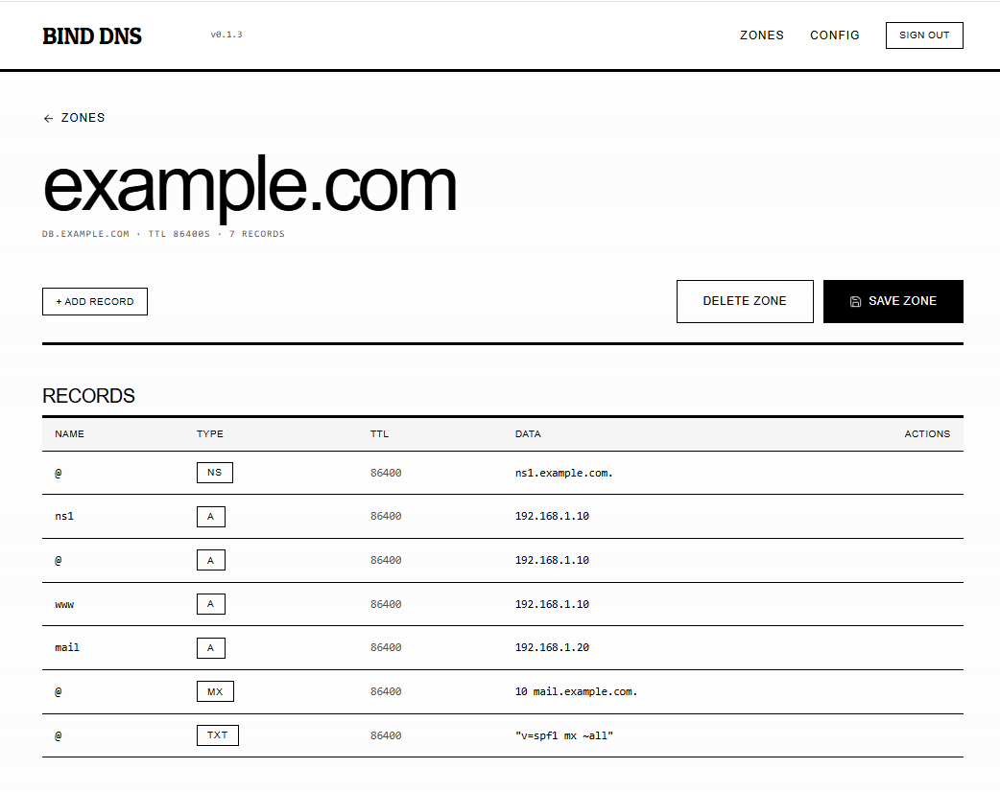

<p align="center">
  <picture>
    <source media="(prefers-color-scheme: dark)" srcset="https://img.shields.io/badge/BIND9%20DNS%20GUI-000000?style=for-the-badge&logo=dns&logoColor=white">
    
  </picture>
</p>

<h1 align="center">Bind DNS GUI</h1>

<p align="center">
  A minimalist web interface for your BIND9 DNS server.<br>
  Edit zone files, manage records, and keep your self-hosted infrastructure running smoothly.
</p>

<p align="center">
  <a href="#-quick-start"></a>
  <a href="docs/configuration.md"></a>
  <a href="docs/architecture.md"></a>
  <a href="https://hub.docker.com/r/migsperez/bind-dns-gui"></a>
  <a href="LICENSE"></a>
</p>

<p align="center">
  
</p>

---

## ✨ Features

- **📝 Zone File Editor** — Edit `db.*` zone files with a clean, table-based UI. No more `vi` on the command line.
- **🔧 Record Management** — Add, edit, and delete DNS records: A, AAAA, CNAME, MX, TXT, PTR, NS, SOA.
- **📂 Config Viewer** — Browse `named.conf` and other BIND configuration files in read-only mode.
- **🔐 Authentication** — Password-protected access via environment variables. Simple, no database required.
- **♻️ Dynamic Updates (RFC 2136)** — Record edits go through nsupdate with TSIG authentication — no container restart needed, SOA serial bumps automatically.
- **🎨 Monochrome Design** — Clean, distraction-free black-and-white interface that means business.
- **🐳 Docker Native** — Ready-to-use Docker image on Docker Hub. Works with your existing BIND9 container.

---

## 🚀 Quick Start

Get up and running in under 2 minutes. You just need Docker.

### 1. Create a project directory

```bash
mkdir bind-dns-gui && cd bind-dns-gui
```

### 2. Create your BIND config directory

```bash
mkdir -p bind/config
```

Bind starts with an empty `named.conf.local` — you don't need any zone files to begin. The first thing you do after logging into the GUI is click **Create zone**, which writes the zone file and registers it with BIND via `rndc addzone`. No templates to copy, no config to edit by hand.

### Importing existing zone files

If you're migrating from an existing BIND server, drop your `db.*` files into `bind/config/` and add `zone` blocks to `named.conf.local` **before** starting the stack. BIND will load and serve them automatically — no command needed — and the GUI will list them read-only right away.

To make those zones **editable** through the GUI, each `zone` block needs:

```bind
allow-update { key "bind-gui-key"; };
```

If your existing blocks already say `allow-update { none; }`, run the one-shot migration script:

```bash
docker compose exec bind-gui node scripts/migrate-to-dynamic.mjs
```

It rewrites the config and runs `rndc reconfig` so the change takes effect without a container restart. If your existing blocks have **no** `allow-update` clause at all, add the line manually.

### 3. Create `compose.yaml`

```yaml
services:
  bind9:
    image: internetsystemsconsortium/bind9:9.18
    container_name: bind9
    restart: unless-stopped
    ports:
      - "53:53/udp"
      - "53:53/tcp"
      - "953:953/tcp"          # rndc control channel
    volumes:
      - ./bind/config:/etc/bind:rw    # writable so BIND can create .jnl journal files
      - bind-cache:/var/cache/bind
    networks:
      - dns-net

  bind-gui:
    image: migsperez/bind-dns-gui:latest
    container_name: bind9-gui
    restart: unless-stopped
    ports:
      - "3001:3001"
    environment:
      - AUTH_SECRET=${AUTH_SECRET}
      - ADMIN_USERNAME=${ADMIN_USERNAME:-admin}
      - ADMIN_PASSWORD=${ADMIN_PASSWORD}
      - NEXTAUTH_URL=http://localhost:3001
      - CONFIG_DIR=/app/bind/config
      - BIND_RNDC_HOST=bind9
      - BIND_DNS_HOST=bind9
      - TSIG_KEY_FILE=/etc/bind/bind-gui.key
    volumes:
      - ./bind/config:/app/bind/config:rw
      - ./bind/config/bind-gui.key:/etc/bind/bind-gui.key:ro
      - /var/run/docker.sock:/var/run/docker.sock:ro
    depends_on:
      bind9:
        condition: service_started
    networks:
      - dns-net

networks:
  dns-net:
    driver: bridge

volumes:
  bind-cache:
```

### 4. Configure environment variables

Copy the example file and edit it:

```bash
cp .env.example .env
```

Then fill in your values:

```env
AUTH_SECRET=$(openssl rand -base64 32)
ADMIN_USERNAME=admin
ADMIN_PASSWORD=changeme-to-something-strong
```

### 5. Generate the TSIG key

This key authenticates communication between the GUI and BIND9:

```bash
docker compose run --rm bind9 tsig-keygen -a hmac-sha256 bind-gui-key > bind/config/bind-gui.key
```

> **Security:** The key file (`bind/config/bind-gui.key`) is automatically excluded from Git via `.gitignore`.

### 6. Start everything

```bash
docker compose up -d
```

### 7. Open the GUI

Visit [**http://localhost:3001**](http://localhost:3001) and log in with your credentials.

That's it. You now have a web UI for your DNS server.

### 7. Point your router at it

For your network to actually *use* this DNS server, configure your router's DHCP settings to hand out the IP of the machine running BIND9 as the primary DNS server. Every device on your network will then resolve domains through your own server — giving you full control over DNS records, local hostnames, and ad-blocking if you choose.

> **Tip:** Make sure the machine running BIND9 has a **static IP address** so it doesn't change after a router reboot.

---

## 📖 Documentation

| Topic | Description |
|-------|-------------|
| [Configuration](docs/configuration.md) | Environment variables, zone files, reverse proxy setup |
| [Architecture](docs/architecture.md) | How it works, tech stack, API routes, design system |
| [Security](docs/security.md) | Auth, best practices, network isolation |
| [Development](docs/development.md) | Local setup, project structure, building from source |

---

## 🐳 Docker Images

Pre-built images are available on Docker Hub:

```bash
docker pull migsperez/bind-dns-gui:latest
```

Images are tagged with:
- `latest` — latest stable release
- `v1.2.3` — full semantic version
- `1.2` — major.minor version

---

## 🧩 How It Works

1. You log into the web GUI and edit your DNS records in a table-based editor.
2. The GUI computes a **diff** between the current records and your changes.
3. The diff is sent as an **nsupdate (RFC 2136)** transaction — a DNS UPDATE message authenticated with a shared **TSIG key**.
4. BIND9 applies the update immediately: it journals the change, auto-bumps the SOA serial, and (with DNSSEC inline-signing) re-signs the zone.
5. For **creating or deleting zones**, the GUI uses `rndc addzone` / `rndc delzone` — no container restart needed.
6. **No container restarts** are required for any zone operation. The Docker socket is retained only as a fallback for the version display.

Your zone files remain on disk as the static source of truth; dynamic journal files (`.jnl`) capture incremental changes. No lock-in.

---

## 📸 Screenshots

> *Screenshots coming soon.*

---

## 🤝 Contributing

Contributions are welcome! See [Development](docs/development.md) for local setup instructions.

---

## 📄 License

[MIT](LICENSE)
